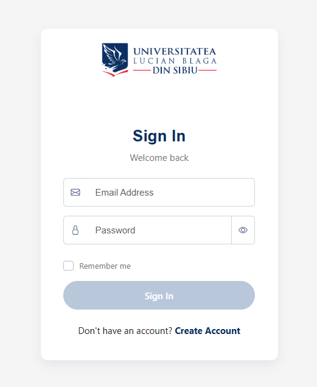
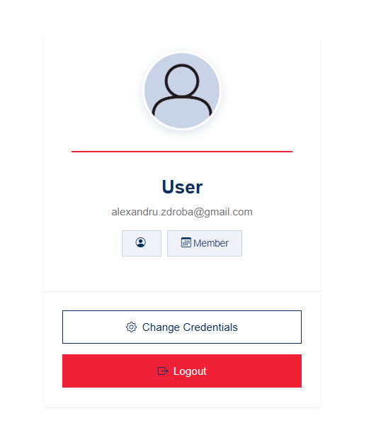
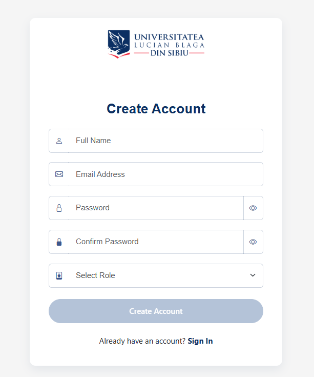
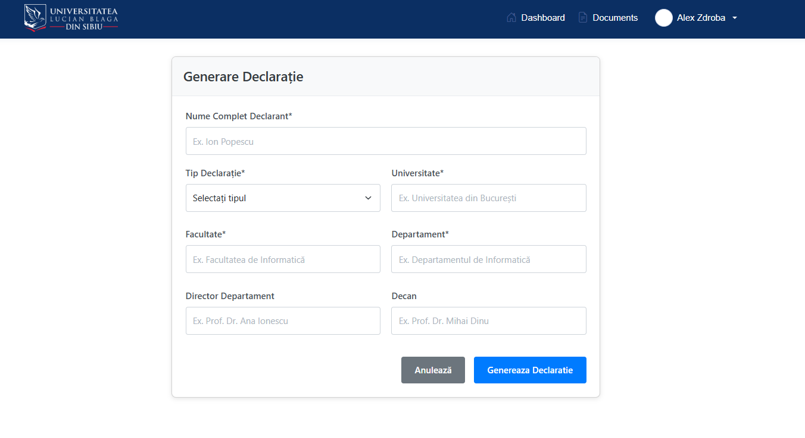
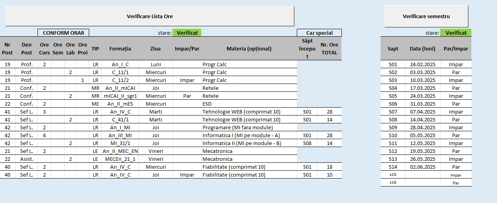
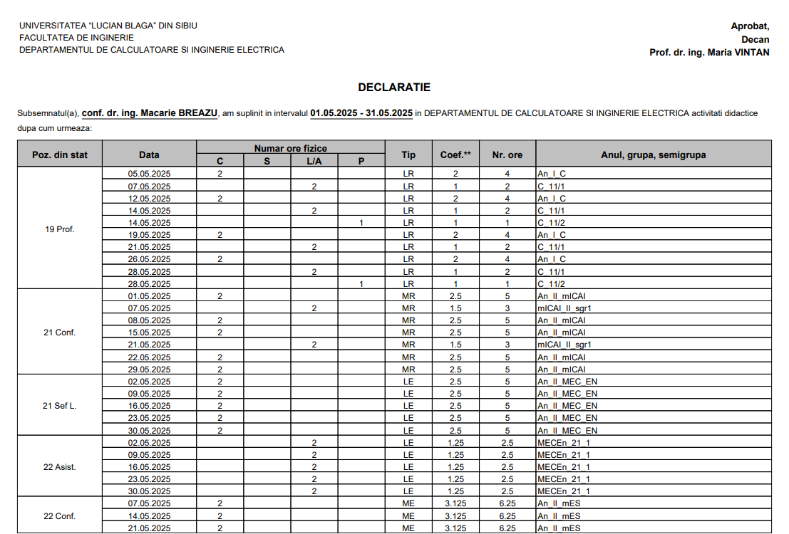

  <h1 style="margin: 0;">Plata cu ora</h1>
  

    
    
  

Aplicatie pentru gestionarea orelor lucrate de catre cadre universitare dezvoltata in cadrul proiectului TechTrek, sustinut de NTT DATA Romania.
prezentarea echipei?

# Introducere
In cadrul unei institutii de invatamant superior, viata academica reprezinta parcursul educational al unui student sau cadru didactic. Ce ar fi parcursul acesta fara o schimbare continua? In secolul XXI tehnologia se dezvolta exponential, iar schimbarea are loc la fiecare pas. 
de bagat mai multa vrajeala: adauga aplicatia de pontaj ca exemplul dezvoltarii (excel-> aplicatie). 
sau spune de cum disciplina trebuie sa fie prezenta atat la studenti cat si la profesori, si de aia o aplicatie de pontaj este importanta. 
sau prezinta ecuatia: ore lucrate = bani, viata - bani = naspa
????totul a pornit de la nevoia de a pune in aplicare cunostiintele dobandite in urma proiectului techtrek

## Context
In cadrul _Universitatii Lucian Blaga din Sibiu_, procesul de generare al fluturasului de salariu pentru un cadru didactic se realiza intr-un mod _demodat_ si greoi. Acest proces consista intr-un fisier Excel cu macro-uri complexe, foarte greu de optimizat si intretinut.
dezvolta: cat de naspa era procesul de completare, cat de antic si invechit pasau unii de la altii un fisier pentru generarea unei declaratii
?shoutout Canti pentru idee

### Scopul aplicatiei
Aplicatia are ca scop automatizarea procesului de completare al orelor lucrate, intr-un mod placut visibil si user friendly.
dezvolta: cat de usor este acum procesul de completare al orelor, fata de cum era inainte cu excel-ul
mai merge putina vrajeala ca in introducere

### Public tinta
Aplicatia are ca public tinta cadre universitare de la universitatea Lucian Blaga. Cu toate acestea, are posibilitatea de se extinde prin includerea altor universitati.
dezvolta: baga vrajeala cat de importante sunt cadrele didactice pentru societate ??????? 
de ce facilitarea activitatilor pe langa cele didactice este triviala. de ce pentru niste loaze batrane e mai usoara aplicatia noastra decat un excel+

## Tehnologii utilizate

De dezvoltat, de ce, cum, unde, cine, pentru
de specificat versiuni
- Angular
- Asp.net
- Firebase
- Bootstrap

## Functionalitati

Aplicatia confera un set de functionalitati esentiale ce simplifica procesul de completare al orelor lucrate de catre personalul didactic, acestea fiind: 

### Autentificare (Login)
- utilizatorii se autentifica folosind adresa de mail si parola
- odata cu succesul autentificarii, se genereaza o cheie unica de acces, prin care se asigura securitatea endpoint-urilor
Adauga tehnologiile implicate
Poate specifici mai putin despre securitate si adaugi un capitol despre asta

  

### Deconectarea (Logout)
- utilizatorii se pot deconecta oricand
- cheia unica de acces este eliminata din sesiune, pastrand securitatea endpoint-urilor
- dupa deconectare, utilizatorul este redirectionat catre pagina de autentificare

  

### Inregistrarea unui cont nou (Register)
- utilizatorii pot crea un cont nou prin completarea campurilor de:
    - nume
    - mail
    - parola
    - rol
- la validarea campurilor (email si confirmare parola), datele utilizatorului sunt introduse in sistem

  

### Completarea detaliilor utilizatorului
- odata autentificat, utilizatorul isi poate completa profilul cu informatiile necesare generarii declaratiei:
    - nume si prenume
    - tip
    - director de departament
    - decan
    - universitate
    - facultate
    - departament
- aceste detalii sunt salvate in sistem

  

### Generarea declaratiei
- pe baza datelor introduse aplicatia genereaza o declaratie personalizata cu datele utilizatorului, numarul total de ore lucrate si calculul sumei
- formatul este similar cu cel utilizat in Excel-ul folosit anterior, si produce un seniment de homesick cadrelor didactice

  

- declaratia este in format pdf si poate fi descarcata/ vizualizata

  

  

### Mentiuni
- aplicatia tine cont de paritatea saptamaniilor
- aplicatia tine cont de zilele libere, folosind un api cu sarbatorile legale

## Securitate ? 
## Proces de dezvoltare ?
## Testare ?x
## Hosting ? 
## Probleme intampinate ?x
## Posibilitati de dezvoltare ?x
## Concluzii finale ? Feedback-ul cadrelor didactice ?x

### schema baza de date, framework-uri, tool-uri

