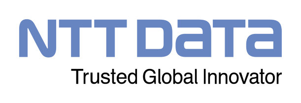

<div style="display: flex; justify-content: space-between; align-items: center; margin-bottom: 20px;">
  <h1 style="margin: 0;">Plata cu ora</h1>
  <div style="display: flex; gap: 20px;">
    
    
  </div>
</div>


Aplicatie pentru gestionarea orelor lucrate de catre cadre universitare dezvoltata in cadrul proiectului TechTrek, sustinut de NTT DATA Romania.


# Introducere
In cadrul unei institutii de invatamant superior, viata academica reprezinta parcursul educational al unui student sau cadru didactic, nu doar participarea la cursuri si sustinerea examenelor. Ce ar fi parcursul acesta fara o schimbare continua? In secolul XXI tehnologia se dezvolta exponential, iar schimbarea are loc la fiecare pas. Cerintele pietei muncii sunt intr-o migratie continua, iar adaptabilitatea devine o componenta esentiala.
<!-- Nu cred ca are relevanta ultima propozitie, dar mi-a placut partea cu adaptabilitatea. -->
Mileniul in care suntem este definit de digitalizare si automatizare. Fie ca vorbim despre platforme educationale online, inteligenta artificiala, sisteme informatice universitare sau metode moderne de evaluare, toate acestea contureaza un nou mod de a intelege și trai viata academica.
<!-- Stiu ca nu are nici cea mai mica legatura cu "plata cu ora", dar mai e inca un pic pana se intra in paine. -->
Proiectele digitale si inovatiile software joaca un rol fundamental in sprijinirea procesului educational. Acest proiect se inscrie in viziunea unei educatii moderne, contribuind, prin mijloace concrete, la imbunatatirea experientei academice.

## Context
In cadrul _Universitatii Lucian Blaga din Sibiu_, procesul de generare al fluturasului de salariu pentru un cadru didactic se realiza intr-un mod <span style="color:red">_demodat_</span> si greoi. Acest proces consista intr-un fisier Excel cu macro-uri complexe, foarte greu de optimizat si intretinut.

### Scopul aplicatiei
Aplicatia are ca scop automatizarea procesului de completare al orelor lucrate, intr-un mod placut visibil si user friendly.
<!-- <span style="color:green">dezvolta: cat de usor este acum procesul de completare al orelor, fata de cum era inainte cu excel-ul</span> -->

### Public tinta
Aplicatia are ca public tinta cadre universitare de la universitatea Lucian Blaga. Cu toate acestea, are posibilitatea de se extinde prin includerea altor universitati.


## Tehnologii utilizate

- Angular 19.2.0
- Asp.net Core 8.0
- Firebase 3.2.0
- Bootstrap 18.0.0
<!-- Sa verifice cineva asta pls. Pentru bootstrap si firebase nu sunt sigur. -->

## Functionalitati

Aplicatia confera un set de functionalitati esentiale ce simplifica procesul de completare al orelor lucrate de catre personalul didactic, acestea fiind: 

### Autentificare (Login)
- utilizatorii se autentifica folosind adresa de mail si parola
- odata cu succesul autentificarii, se genereaza o cheie unica de acces, prin care se asigura securitatea endpoint-urilor
<div style="display: flex; justify-content: center;">
  
</div>


### Deconectarea (Logout)
- utilizatorii se pot deconecta oricand
- cheia unica de acces este eliminata din sesiune, pastrand securitatea endpoint-urilor
- dupa deconectare, utilizatorul este redirectionat catre pagina de autentificare
<div style="display: flex; justify-content: center;">
  
</div>


### Inregistrarea unui cont nou (Register)
- utilizatorii pot crea un cont nou prin completarea campurilor de:
    - nume
    - mail
    - parola
    - rol
- la validarea campurilor (email si confirmare parola), datele utilizatorului sunt introduse in sistem
<div style="display: flex; justify-content: center;">
  
</div>


### Completarea detaliilor utilizatorului
- odata autentificat, utilizatorul isi poate completa profilul cu informatiile necesare generarii declaratiei:
    - nume si prenume
    - tip
    - director de departament
    - decan
    - universitate
    - facultate
    - departament
- aceste detalii sunt salvate in sistem
<div style="display: flex; justify-content: center;">
  
</div>


### Generarea declaratiei
- pe baza datelor introduse aplicatia genereaza o declaratie personalizata cu datele utilizatorului, numarul total de ore lucrate si calculul sumei
- formatul este similar cu cel utilizat in Excel-ul folosit anterior, <span style="color: red">si produce un seniment de homesick cadrelor didactice</span>
<div style="display: flex; justify-content: center;">
  
</div>

- declaratia este in format pdf si poate fi descarcata/ vizualizata
<div style="display: flex; justify-content: center;">
  
</div>
<div style="display: flex; justify-content: center;">
  
</div>

### Proces de dezvoltare

Procesul de dezvoltare al aplicatiei Plata Cu Ora a a fost unul iterativ si adaptat cerintelor reale ale utilizatorilor. Totul a pornit de la o idee simpla: sa inlocuim un proces greoi, bazat pe Excel-uri plimbate pe email sau stick, cu o solutie web moderna si accesibila. De aici a urmat un parcurs clasic de dezvoltare software: analiza cerintelor, proiectare, implementare, testare si imbunatatire continua.

##### Etapa initiala - Proiectul TechTrek
Aplicatia a fost dezvoltata in cadrul proiectului TechTrek, organizat cu sprijinul NTT Data Romania. Acesta a oferit cadrul perfect pentru a experimenta si pune in practica cunostintele teoretice dobandite in cadrul cursurilor urmate. Echipa a fost impartita in roluri clare (frontend, backend, documentatie, testare), iar comunicarea s-a realizat in principal prin GitHub si grupuri de lucru pe Teams/Whatsapp.

##### Prima etapa: infrastructura si autentificare
Proiectul a inceput cu partea de autentificare a utilizatorilor. S-au implementat functionalitatile de login si inregistrare folosind Angular pentru frontend si ASP.NET pentru backend. De la inceput datele sensibile precum cheia API pentru Firebase au fost protejate in fisiere .gitignore.


##### Iteratii successive: interfata si experienta utilizatorului
Pe masura ce baza autentificarii a fost stabilita, echipa a lucrat in paralel pe mai multe ramuri:

- Crearea si stilizarea componentelor folosind Bootstrap si culorile oficiale ULBS  
- Salvarea si completarea automata a datelor utilizatorului pentru generarea declaratiei 

Fiecare functionalitate noua a fost tratata intr-o ramura separata de Git (feature/*) si apoi integrata pe branch-ul main prin pull request-uri. Pull request-urile necesita 2 aprobari pentru a fi integrate cu succes pe branch-ul main, asa ca spiritul de echipa a fost ridicat de review-urile si comentariile lasate pe PR sau in privat, de catre alti membrii.  Practica aceasta a permis fiecarui membru sa 'isi spuna off-ul' si a redus riscul aparitiei conflictelor, nicio decizie fiind luata individual.
<!-- Poate formulezi un pic mai frumos -->

##### Generarea declaratiei si exportul in PDF
O etapa cheie a fost generarea declaratiei de plata, care a trebuit sa respecte un format deja familiar cadrelor didactice. Initial s-a lucrat cu html2pdf.js, dar din cauza limitarilor, s-a trecut la solutii .NET pentru generarea PDF-urilor direct din backend.

##### Google Auth si integrarea serviciilor externe
In paralel cu functionalitatile principale, s-a lucrat la integrarea login-ului cu Google. Desi partea de backend a fost rapid implementata, conectarea efectiva a serviciului Google cu partea de UI a avut intarzierile sale, din cauza = = = == = == = = = = = == = .
<!-- Nu stiu ce sa zic. Pare neprofesional daca zic de concedii. Poate sterg partea asta.   -->

##### Implementarea zilelor libere
Am integrat un API pentru zilele libere nationale, cu un endpoint dedicat. Aceste date sunt importante in calculul corect al numarului de ore lucrate si al sumei finale din declaratie.

(aici poti adauga un mic snippet despre cum sunt filtrate orele in functie de zile libere sau cum se face apelul catre API)

##### Securitatea aplicatiei
In final, s-a acordat atentie securizarii endpoint-urilor, asigurandu-se ca doar utilizatorii autentificati pot accesa sau modifica date. Tokenul JWT este validat pentru fiecare request, iar datele sensibile sunt criptate in baza de date.

Dupa cum putem vedea in secventa de mai jos, in baza esecului validarii tokenului, user-ul este dat afara din aplicatie (logout).
<!-- Am vrut sa zic parasutat afara din aplicatie dar era mai amuzant in mintea mea doar. -->
```angular
this.http.post<{valid: boolean}>(`${environment.apiBaseUrl}/api/user/verify-token`, { token })
      .pipe(catchError(() => of({ valid: false })))
      .subscribe(response => {
        if (!response.valid) {
          this.logout();            //here
        }
      });
```
Verificarea tokenului merge pana in cel mai adanc strat al arhitecturii layered unde logica de validare este abstractizata intr-un mod simplu, evidand duplicarea codului.
<!-- Aici sunt 100% ca trebuie scris altceva. Doar voiam sa pun si un segment de cod c#. -->
```angular
this.http.post<{valid: boolean}>(`${environment.apiBaseUrl}/api/user/verify-token`, { token })
      .pipe(catchError(() => of({ valid: false })))
      .subscribe(response => {
        if (!response.valid) {
          this.logout();
        }
      });
```


##### Refactorizare si documentatie
Pe masura ce functionalitatile au fost consolidate, s-a trecut la refactorizarea codului, imbunatatirea naming-ului si structurii proiectului. De asemenea, a fost creata o structura coerenta de documentatie pentru a sprijini prezentarea si eventual pitch-ul catre alte institutii.
<!-- (README.md, foldere img/demo, img/old_excel, etc.)  -->
<!-- Formularea cu pitch ul mi se pare ca din topor. -->


## Hosting 

_tbd_

---

